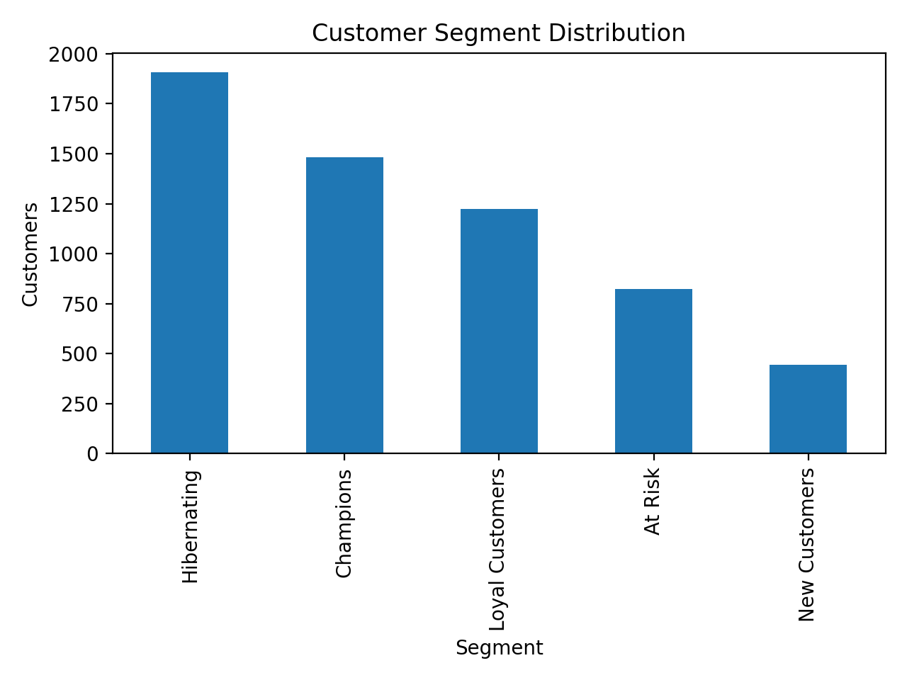
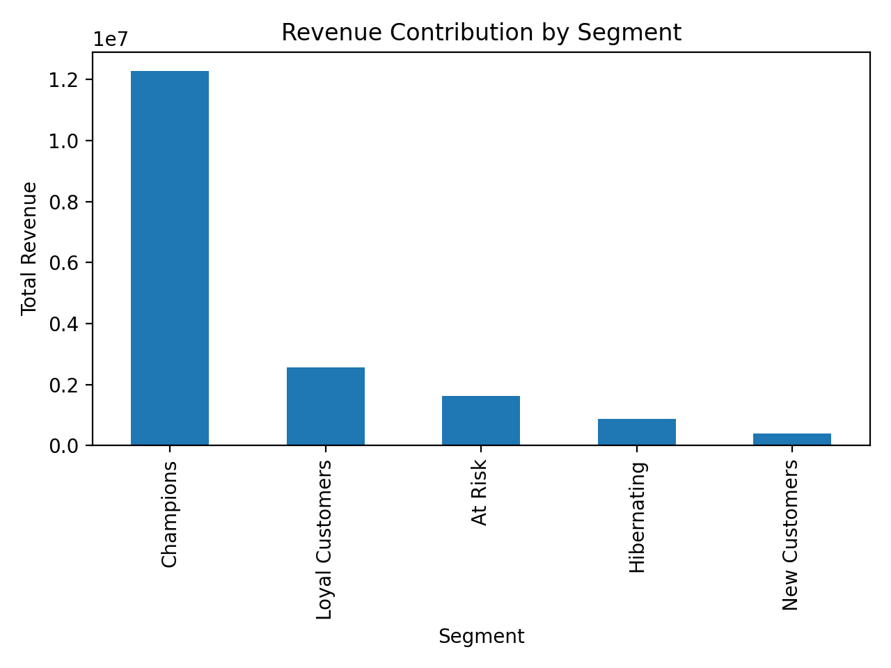
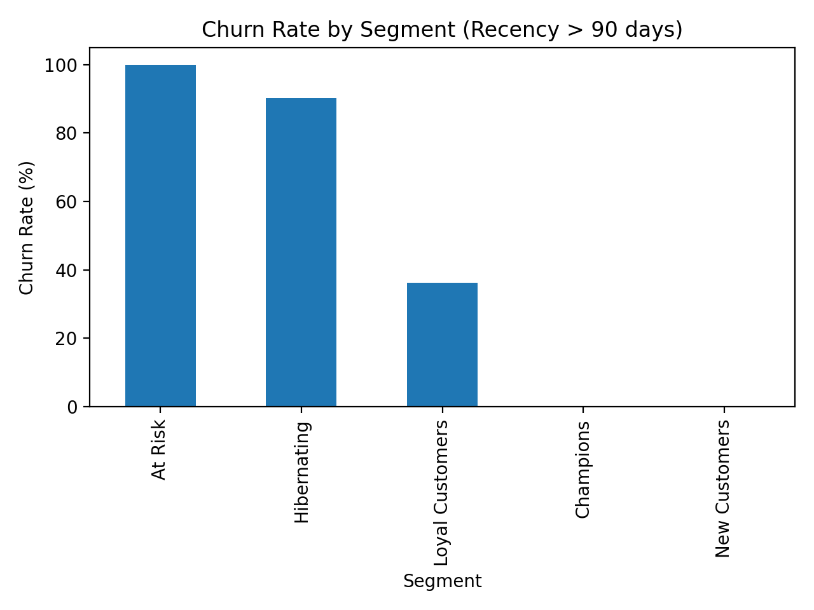
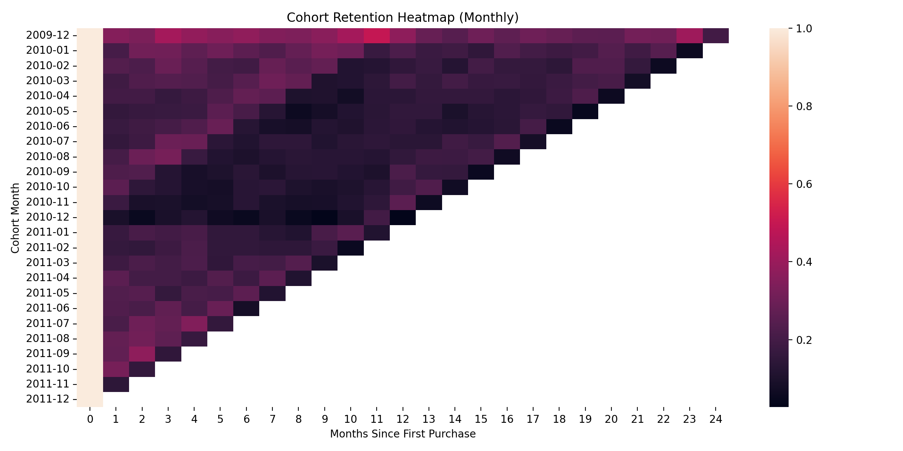

# Customer Churn & RFM Segmentation Analytics (End-to-End)

## Overview
This project builds an end-to-end customer analytics workflow to identify high-value customer segments and customers at risk of churn. Using transaction-level purchase history, the solution delivers:
- **RFM segmentation** (Recency, Frequency, Monetary) for customer value profiling  
- **Churn proxy analysis** using inactivity thresholds  
- **Cohort retention analysis** to understand repeat behavior over time  
- **Revenue impact & ROI simulation** in Excel to quantify retention strategy value  
- **Power BI dashboard** for interactive monitoring and stakeholder reporting  

The repository is structured as a reusable framework for churn monitoring and segmentation-based retention planning.

---

## Business Objective
**Identify customers at risk of churn and high-value segments, then translate insights into actionable retention strategies** to reduce attrition and maximize revenue.

Key questions answered:
- Which segments contribute the most revenue and need protection?
- Which segments show the highest churn risk and require intervention?
- How does retention behave across cohorts (month-0, month-1, …)?
- What is the estimated revenue impact of improving churn by a small percentage?

---

## Dataset
**Online Retail II** (transaction-level retail data), containing:
- Invoice-level transactions with product and customer identifiers
- Purchase quantities, unit prices, invoice timestamps
- Customer geography

---

## Tech Stack
- **SQL Server (SSMS)**: data validation, RFM aggregation, scoring logic (quintiles using window functions)
- **Python (pandas, numpy, matplotlib, seaborn)**: data cleaning, feature engineering, churn proxy, cohort retention, figure export
- **Excel**: revenue impact modeling and ROI simulation scenarios
- **Power BI**: dashboarding for segmentation, revenue contribution, and churn risk monitoring

---

## Methodology

### 1) Data Preparation & Cleaning (Python)
A clean transaction layer is created to ensure valid RFM computation:
- Removed missing `customer_id`
- Removed cancelled invoices (invoice prefix “C”)
- Removed non-positive quantities
- Created `total_amount = quantity * price`
- Standardized column names and parsed `invoicedate`

Output:
- `data/processed/transactions_clean.csv`

---

### 2) Feature Engineering: RFM Metrics (Python)
Customer-level metrics are computed using a snapshot date defined as:
- `snapshot_date = max(invoicedate) + 1 day`

RFM definitions:
- **Recency**: days since last purchase  
- **Frequency**: distinct invoices per customer  
- **Monetary**: total revenue per customer  

Output:
- `data/processed/customer_rfm_segments.csv`

---

### 3) RFM Scoring (Quintiles)
Each customer receives 1–5 scores (5 = best) using quintiles:
- `R` score inverted (lower recency is better)
- `F` and `M` higher is better

A combined code is created:
- `rfm_score = r_score + f_score + m_score` (e.g., **555**)

This enables consistent segmentation and dashboarding.

---

### 4) Segmentation (Business-Friendly Labels)
Customers are mapped into segments for action:
- **Champions**: recent + frequent (high priority retention / VIP)
- **Loyal Customers**: consistent repeat customers (grow and protect)
- **New Customers**: recent but low frequency (activation and onboarding)
- **At Risk**: not recent but historically active (reactivation focus)
- **Hibernating**: inactive and low engagement (low-cost winback only)

---

### 5) Churn Proxy (Inactivity Threshold)
Since explicit churn labels are not provided, churn is defined as a business proxy:
- **Churned = Recency > 90 days**

This enables practical churn monitoring and segment-level risk identification.

---

### 6) Cohort Retention (Monthly)
A monthly cohort model tracks retention as:
- Cohort month = customer’s first purchase month
- Cohort index = months since first purchase

The retention matrix is exported and visualized as a heatmap to identify:
- early drop-off behavior
- cohort quality differences
- long-tail retention patterns

---

### 7) Revenue Impact & ROI Simulation (Excel)
An executive-style scenario model estimates the value of churn improvements.

Inputs:
- Total Revenue
- Current churn rate (assumption)
- Target churn reduction (scenario)
- Campaign cost (scenario)

Outputs:
- Revenue at risk
- Incremental revenue gain
- Net impact
- ROI

This converts analytics into business decision support.

---

## Key Results (From Your Run)

### Segment & Revenue Concentration
- **Champions** contribute ~**69%** of revenue → highest protection priority
- **At Risk** and **Hibernating** represent major churn exposure → reactivation and winback targets

### Churn Proxy (Recency > 90 days)
- Overall churn proxy: **50.9%**
- Highest churn exposure concentrated in **At Risk** and **Hibernating**

### Revenue Impact Model (Excel)
- Total revenue: **17.74M**
- Revenue at risk (30% churn): **5.32M**
- 5% churn reduction → **~$266K** incremental revenue
- Example ROI: $50K campaign → **~432% ROI**

---

## Visual Outputs (Python Exported)
### Customer Segment Distribution

### Revenue Contribution by Segment

### Churn Rate by Segment (Proxy)

### Cohort Retention Heatmap

---

## Power BI Dashboard
The Power BI report provides an interactive view of:
- Total customers, total revenue, churn rate
- Segment distribution
- Revenue contribution by segment
- Churn volume by segment

File:
- `dashboards/Customer_Churn_RFM_Dashboard.pbix`

---

## SQL Implementation (SSMS)
RFM is also implemented in SQL Server to demonstrate analytics capability using:
- Aggregations
- CTEs
- Window functions (`NTILE`) for quintile scoring

Exported file:
- `data/processed/rfm_sql_export.csv` / `.xlsx`

---

## Project Structure
customer_churn_rfm_analytics/
├── dashboards/
│   └── Customer_Churn_RFM_Dashboard.pbix
├── data/
│   ├── raw/
│   └── processed/
│       ├── transactions_clean.csv
│       ├── customer_rfm_segments.csv
│       └── rfm_sql_export.xlsx
├── outputs/
│   ├── figures/
│   │   ├── 01_segment_distribution.png
│   │   ├── 02_revenue_by_segment.png
│   │   ├── 03_churn_rate_by_segment.png
│   │   └── 04_cohort_retention_heatmap.png
│   └── reports/
│       └── Revenue_Impact_Model.xlsx
├── src/
│   ├── data/
│   ├── features/
│   ├── analysis/
│   └── visualization/
├── requirements.txt
├── .gitignore
└── README.md